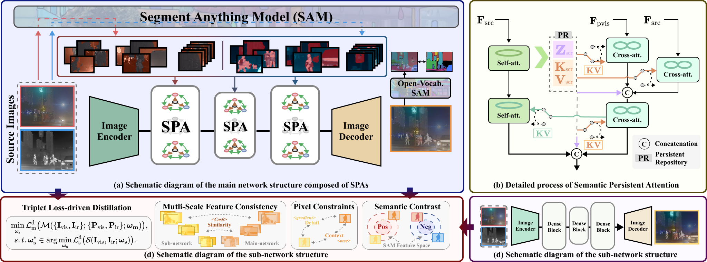

# SAGE
Official Code for: Guanyao Wu, Haoyu Liu, Hongming Fu, Yichuan Peng, Jinyuan Liu, Xin Fan, Risheng Liu*,**“Every SAM Drop Counts: Embracing Semantic Priors for Multi-Modality Image Fusion and Beyond”**.
- [*[Google Scholar]*](https://scholar.google.com.hk/scholar?hl=zh-CN&as_sdt=0%2C5&q=Every+SAM+Drop+Counts%3A+Embracing+Semantic+Priors+for+Multi-Modality+Image+Fusion+and+Beyond&btnG=)
## Preview of SAGE
---


## Set Up on Your Own Machine

### Virtual Environment

We strongly recommend that you use Conda as a package manager.

```shell
# create virtual environment
conda create -n sage python=3.10
conda activate sage
# select and install pytorch version yourself (Necessary & Important)
# install requirements package
pip install -r requirements.txt
```
#### Data Preparation

You should put the data in the correct place in the following form.

```
SAGE ROOT
├── data
|   ├── M3FD
|   |   ├── Ir # infrared images
|   |   └── Vis # visible images
|   ├── TNO
|   |   ├── Ir # infrared images
|   |   └── Vis # visible images
|   ├── RoadScene
|   └── ...
```
### Test / Train
This code natively supports the same naming for infrared and visible image pairs. An naming example can be found in **./data/M3FD** folder.
```shell
# Test: use given example and save fused color images to result/M3FD
# If you want to test the custom data, please modify the file path in 'test.py'
python test.py

