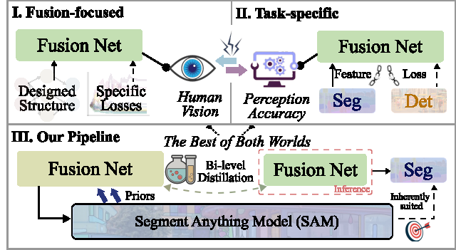

# SAGE
Official Code for: Guanyao Wu, Haoyu Liu, Hongming Fu, Yichuan Peng, Jinyuan Liu, Xin Fan, Risheng Liu*,**“Every SAM Drop Counts: Embracing Semantic Priors for Multi-Modality Image Fusion and Beyond”**.
- [*[Google Scholar]*](https://scholar.google.com.hk/scholar?hl=zh-CN&as_sdt=0%2C5&q=Every+SAM+Drop+Counts%3A+Embracing+Semantic+Priors+for+Multi-Modality+Image+Fusion+and+Beyond&btnG=)
## Preview of SAGE
---


## Set Up on Your Own Machine

### Virtual Environment

We strongly recommend that you use Conda as a package manager.

```shell
# create virtual environment
conda create -n sage python=3.10
conda activate sage
# select and install pytorch version yourself (Necessary & Important)
# install requirements package
pip install -r requirements.txt
```
#### Data Preparation

You should put the data in the correct place in the following form.

```
SAGE ROOT
├── data
|   ├── test
|   |   ├── M3FD
|   |   |   ├── Ir # infrared images
|   |   |   └── Vis # visible images
|   |   ├── TNO
|   |   |   ├── Ir # infrared images
|   |   |   └── Vis # visible images
|   |   ├── RoadScene
|   |   └── ...
|   ├── train
|   |   ├── Ir # infrared images
|   |   ├── Vis # visible images
|   |   ├── Label # segmentation ground truth masks
|   |   └── Mask_cache # cached segmentation masks generated by SAM
```
### Test
This code natively supports the same naming for infrared and visible image pairs. An naming example can be found in **./test/M3FD** folder.
```shell
# Test: use given example and save fused color images to result/M3FD
# If you want to test the custom data, please modify the file path in 'test.py'
python test.py
```
### Train
Before training, you need to download the following pre-trained models:
1. Download [*SAM（VIT-B）*](https://github.com/facebookresearch/segment-anything) pre-trained model and place it in the SAM folder.
2. Download [*Xdecoder(Focal-L last checkpoint)*](https://github.com/microsoft/X-Decoder/tree/main) pre-trained model and place it in the xdecoder folder.
```shell
# Train: Please prepare the custom data and save resluts to result
python train.py
```
### Any Question

If you have any other questions about the code, please open an issue in this repository or email us at  `lhy1415291484@gmail.com`.

If you still have any other questions, please email `rollingplainko@gmail.com`.

## Citation

If this work has been helpful to you, please feel free to cite our paper!

```
@inproceedings{wu2025sage,
  title={Every SAM Drop Counts: Embracing Semantic Priors for Multi-Modality Image Fusion and Beyond},
  author={Wu, Guanyao and Liu, Haoyu and Fu, Hongming and Peng, Yichuan and Liu, Jinyuan and Fan, Xin and Liu, Risheng},
  booktitle={Proceedings of the IEEE/CVF Conference on Computer Vision and Pattern Recognition},
  year={2025}
}
```
