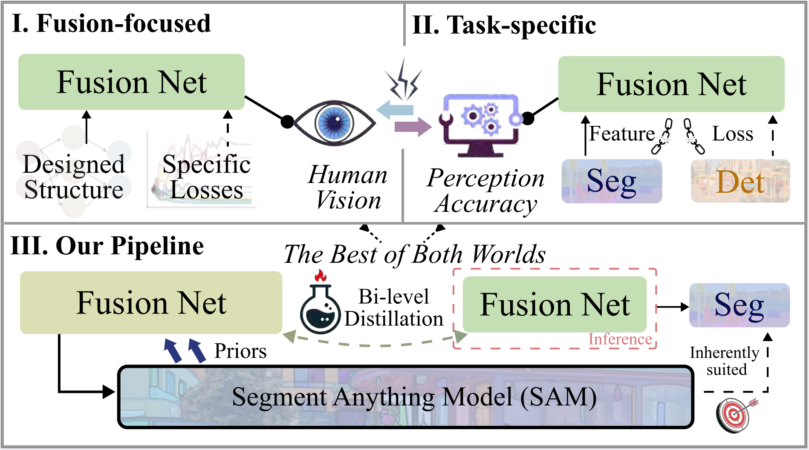
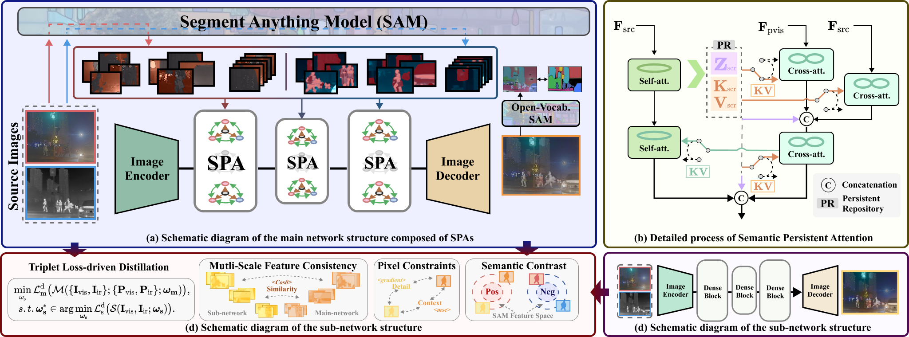

# 🔥 SAGE 

<div align="center">

[](https://scholar.google.com.hk/scholar?hl=zh-CN&as_sdt=0%2C5&q=Every+SAM+Drop+Counts%3A+Embracing+Semantic+Priors+for+Multi-Modality+Image+Fusion+and+Beyond&btnG=)
[](https://github.com/RollingPlain/SAGE_IVIF)
[](https://pytorch.org/)
[](https://opensource.org/licenses/MIT)

</div>

Official Code for: **"Every SAM Drop Counts: Embracing Semantic Priors for Multi-Modality Image Fusion and Beyond"**  
*Guanyao Wu, Haoyu Liu, Hongming Fu, Yichuan Peng, Jinyuan Liu, Xin Fan, Risheng Liu\**  
**IEEE/CVF Conference on Computer Vision and Pattern Recognition (CVPR) 2025**
- [*[Google Scholar]*](https://scholar.google.com.hk/scholar?hl=zh-CN&as_sdt=0%2C5&q=Every+SAM+Drop+Counts%3A+Embracing+Semantic+Priors+for+Multi-Modality+Image+Fusion+and+Beyond&btnG=)

## 📚 Further Reading
For a comprehensive overview of the IVIF field, please refer to our recent survey paper published in **IEEE TPAMI**:

**"Infrared and Visible Image Fusion: From Data Compatibility to Task Adaption"**
- [[Paper](https://ieeexplore.ieee.org/abstract/document/10812907)] [[GitHub](https://github.com/RollingPlain/IVIF_ZOO)]

This survey provides a systematic review of IVIF methods, evaluation metrics, datasets, and applications, which can help you better understand the context and significance of our SAGE framework.

## 📝 Citation

If our work has been helpful to you, please feel free to cite our paper:

```bibtex
@inproceedings{wu2025every,
  title={Every SAM Drop Counts: Embracing Semantic Priors for Multi-Modality Image Fusion and Beyond},
  author={Wu, Guanyao and Liu, Haoyu and Fu, Hongming and Peng, Yichuan and Liu, Jinyuan and Fan, Xin and Liu, Risheng},
  booktitle={Proceedings of the Computer Vision and Pattern Recognition Conference},
  pages={17882--17891},
  year={2025}
}
```
If you find our survey on IVIF helpful, please consider citing:
```bibtex
@article{liu2025infrared,
 title={Infrared and Visible Image Fusion: From Data Compatibility to Task Adaption},
 author={Liu, Jinyuan and Wu, Guanyao and Liu, Zhu and Wang, Di and Jiang, Zhiying and Ma, Long and Zhong, Wei and Fan, Xin and Liu, Risheng},
 journal={IEEE Transactions on Pattern Analysis and Machine Intelligence},
 year={2025},
 volume={47},
 number={4},
 pages={2349-2369}
 }
```

## 🌟 Preview of SAGE
### Differences between the proposed method and existing mainstream comparative approaches:
<div align="center">
  
</div>

**(Ⅰ)** Traditional and early DL-based methods focus on the fusion visual effect. **(Ⅱ)** Task-specific methods (e.g., TarDAL & SegMiF) introduce task loss and features that lead to inconsistent optimization goals, causing a conflict between visual and task accuracy. **(Ⅲ)** Our pipeline first leverages semantic priors from SAM within a large network and then distills the knowledge into a smaller sub-network achieving practical inference feasibility while ensuring "the best of both worlds" through SAM's inherent adaptability to these tasks.*

### Overall workflow of our proposed method：
<div align="center">
  
</div>

**(a)** The flow structure of the main network, where the SPA module processes patches with semantic priors generated by SAM. **(b)** The detailed structure of the SPA module, where PR plays a key role in preserving the source and integrating semantic information. **(c)** Our distillation scheme formulation, with visualizations of the different components of the triplet loss. **(d)** A simple diagram of the sub-network, composed of stacked dense blocks.*


## 🚀  Set Up on Your Own Machine

### 🛠️ Virtual Environment

We strongly recommend that you use Conda as a package manager.

```shell
# create virtual environment
conda create -n sage python=3.10
conda activate sage
# select and install pytorch version yourself (Necessary & Important)
# install requirements package
pip install -r requirements.txt
```
#### 📂 Data Preparation

You should put the data in the correct place in the following form.

```
SAGE ROOT
├── data
|   ├── test
|   |   ├── Ir # infrared images
|   |   └── Vis # visible images
|   ├── train
|   |   ├── Ir # infrared images
|   |   ├── Vis # visible images
|   |   ├── Label # segmentation ground truth masks
|   |   └── Mask_cache # cached segmentation masks generated by SAM
```
### 🧪  Test
This code natively supports the same naming for infrared and visible image pairs. An naming example can be found in ``./data/test/`` folder.
```shell
# Test: use given example and save fused color images to``./result/test``
# If you want to test the custom data, please modify the file path in 'test.py'
python test.py
```
### 🔄 Train
**1. Pretrained models**

Before training, you need to download the following pre-trained models:

Download [*SAM(VIT-B)*](https://github.com/facebookresearch/segment-anything) and [*Xdecoder(Focal-L last)*](https://github.com/microsoft/X-Decoder/tree/main) pre-trained model and place it in the  ``./SAM/`` and  ``./xdecoder/`` folder respectively.

**2. Data Preparation**

Download the [*FMB*](https://github.com/JinyuanLiu-CV/SegMiF) dataset or prepare your custom dataset and organize it according to the **Data Preparation** guidelines.

**3. SAGE Training**
```shell
# Train: Training results for the sub-network and main network are stored in the ``./result/student/`` and ``./result/teacher/`` directories respectively.
python train.py
```
### ❓  Any Question

If you have any other questions about the code, please open an issue in this repository or email us at  `lhy1415291484@gmail.com`.

If you still have any other questions, please email `rollingplainko@gmail.com`.


